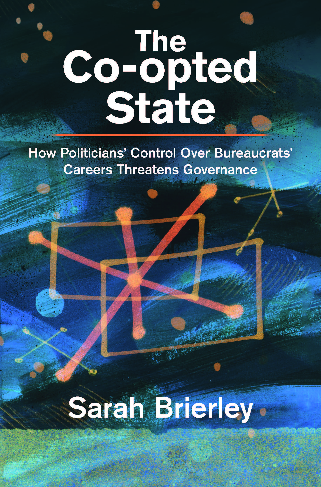

  

  

## Overview

Politicians in young democracies face a dilemma when it comes to investing in state capacity. On the one hand, investments in bureaucratic competence can aid policy implementation. On the other hand, such investments can reduce bureaucratic loyalty, thereby undermining politicians' ability to secure votes through targeted distribution. In The Co-opted State, I argue that to resolve this dilemma, politicians will recruit bureaucrats through procedures that reward merit but retain tools to control bureaucrats' career progression. 

The electronic version of this book is available as Open Access on Cambridge Core. I thank the LSE Open Access Books Fund for covering the costs to make the book open access. 

## Publisher

Cambridge University Press 

## Purchase links

- [CUP](https://www.cambridge.org/core/books/coopted-state/B0F9316D16E1B4C51B45520D7148D132)
- [Amazon](https://www.amazon.co.uk/Co-opted-State-Politicians-Bureaucrats-Institutions/dp/1009757245)
- [Waterstones (UK)](https://www.waterstones.com/book/the-co-opted-state/sarah-brierley/9781009757249)

  

## Reviews

'This compelling book lays out the political challenges of good governance and public administration in new democracies. Through both deep qualitative insights and meticulous quantitative work, Brierley explores how politicians' career control over bureaucrats has profound implications on outcomes from corruption to local public goods provision. This book is indispensable reading for those of us who care about bureaucracy and the state.' Mai Hassan, Associate Professor of Political Science, Massachusetts Institute of Technology

'When does a meritocratic bureaucracy fail to deliver public services efficiently? In this incisive and illuminating analysis, Brierley provides a compelling answer: politicians exert control over bureaucrats to win elections and stay in power. A fascinating study of enormous interest to scholars working on bureaucratic autonomy and state capacity.' Anna Grzymala-Busse, Professor of Political Science, Stanford University

'This book shows that hiring competent bureaucrats does not ensure effective government service delivery. Instead, through careful theorizing and rich qualitative and quantitative analyses, Brierley demonstrates that politicians' motivations and opportunities to control bureaucrats' careers shape whether governments deliver much-needed goods or divert and misuse resources. A must-read for scholars of distributive politics, governance, and state capacity in the Global South.' Rebecca Weitz-Shapiro, Associate Professor of Political Science, Brown University

'Brilliantly framed around the sub-disciplines of political economy and public administration, and drawing on her deep knowledge of Ghanaian politics, Dr. Brierley's book highlights the pernicious effects of the commonplace failure to adequately insulate the public bureaucracy from partisan political control. It draws needed attention to a key gap in many African nations' governance architecture, and an often-neglected lesson from the rich literature on the East and Southeast Asian 'developmental state.'' E. Gyimah-Boadi, Professoer and Afrobarometer co-founder
